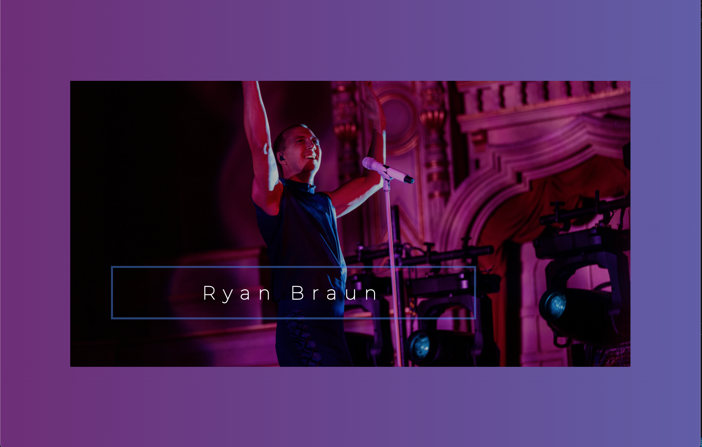
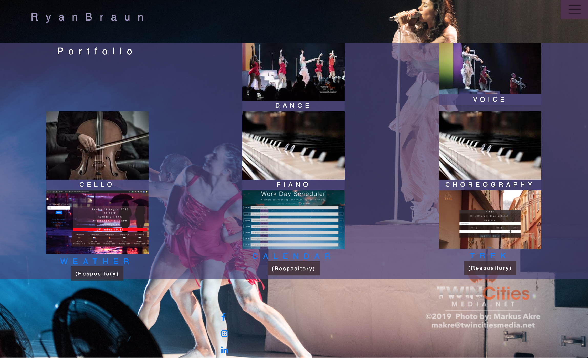

# Ryan Braun Portfolio

***This portfolio page needs to be reformatted to include new work.  The portfolio page needs to be redesigned, animations need to be added, background vidoes, etc.***

link to deployed website:  https://rbraun04.github.io/Ryan-Braun-Artist-Portfolio/

## Project Description 
    This is a my professional portfolio that outlines my work as an artist and coder.  It features images from my last tour as well as examples of work on HTML5, CSS3, JavaScript, jQuery, Bootstrap, Express.js, React.js, Node.js, Database Theory, MongoDB, MySQL, Command Line, Git, and others.  The wesbite includes a link to my social media as well as a way to contact me with questions.
                        
 ## Table of Contents
* [Project Description](#project-description)
* [Installation Instructions](#installation-instructions)
* [Usage Information](#usage-information)
* [Contribution Guidelines](#contribution-guidelines)
* [Test Instructions](#test-instructions)
* [Questions](#questions)

                        
 ## Installation Instructions

   No installations required!
                        
 ## Usage Information

    Can be used on any web browser.    
                        
 ## Contribution Guidelines
    
    Built by Ryan Braun.
                        
 ## Test Instructions
 
    No testing needed.
                        
 ## Questions
 
            Feel free to contact me via Gifthub or by my e-mail!
Github Username:  rbraun04

 <a href = "https://github.com/rbraun04">GitHub</a> - Click to go to my profile!

 Email:  ryan@thelyricla.com

[![LinkedIn][linkedin-shield]][linkedin-url]
 

For this homework I developed an artist portfolio that utilized images already located on the web.  I decided to style the project using a background image to be universal on every page and added transparent properties whenever needed.  I used a navbar header to drop down the page locations and styled appropriately.  I added a footer that links to my social media (FB, Instagram, LinkedIn).  I ran into issues and had to add media queries to assist with the changing shape of the background image as well as the toggler color so that it was more visible on smaller platforms.

When I began the project I was using a different repositoy labeled "Homework-2".  I recieved feedback after my last assignment to come up with more creative names for my repositories so I started a new repository for this project, deleting the old repository.  I realized that wasn't the most intelligent decision as it erased my commit history.  That is why this folder only has 2 commits.  Woops!  I will commit my future assignments more frequently and change the repository name instead of deleting the repository entirely.

Thank you!

[linkedin-shield]: https://img.shields.io/badge/-LinkedIn-black.svg?style=flat-square&logo=linkedin&colorB=555
[linkedin-url]: https://linkedin.com/in/ryangbraun

